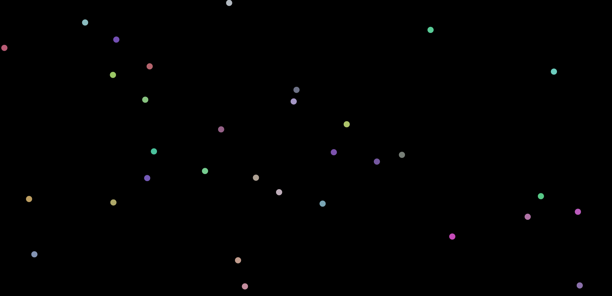

# Bolls Colliding Simulation with Gravity Effect

[versão em português](README.pt.md)

Small project I made to play around with animations with JS. 
It starts random bolls on the canvas with random velocities and simulates
the movements and collisions. Afterwards, I added the gravity effect 
to the bolls.

Press mouse right button: Adds gravity effect towards the cursor 
position.

CTRL key: Spawns a new boll on the environment at the cursor position.